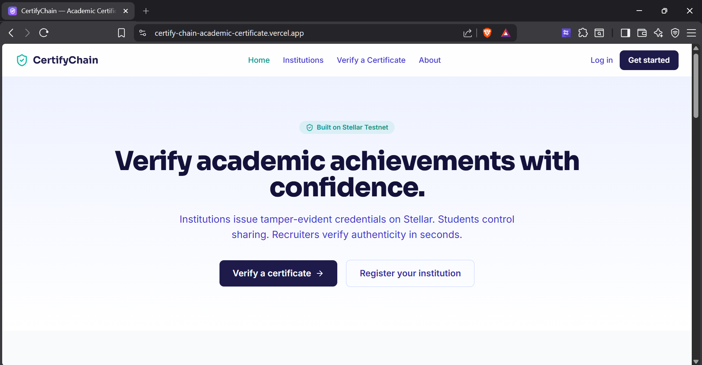
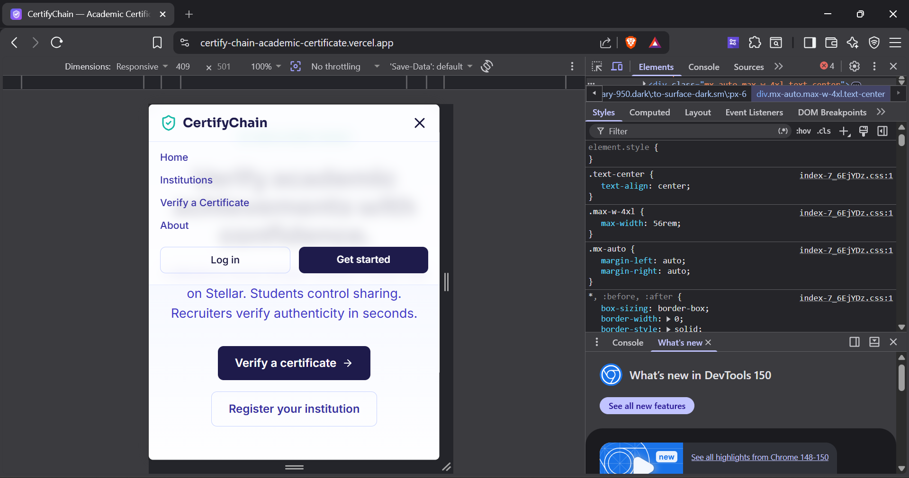
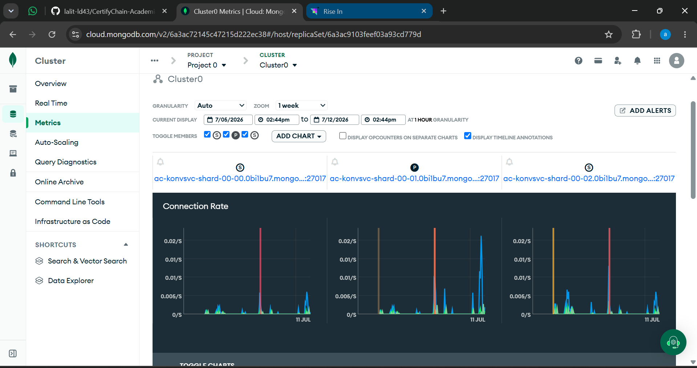

# CertifyChain — Academic Certificate Verification on Stellar

> A production-ready Stellar dApp where institutions issue verifiable academic credentials, students hold them, and employers instantly verify on-chain proofs without manual background checks.

## 🚀 Quick Links
- **Live Platform**: [certifychain.vercel.app](https://certify-chain-academic-certificate.vercel.app/)
- **Demo Video**: [Watch the Demo](https://drive.google.com/file/d/1WSV6MVlQKfstvySNlAqYRVm9AudT2UV_/view?usp=sharing)
- **Contract Deployment Address**: `CBVSXZHSAFAVTTCD4AUU7RXIL6FX26NZQ7RSXTYTFB2L3RDQU3PCOJ4Q`
- **User Feedback Form**: [CertifyChain Feedback Form](https://docs.google.com/forms/d/e/1FAIpQLSdpyani5-iJCVfaJXmDxVOQFlRyZB2dXKn0EV-p6XN7sfIjPw/viewform)
- **User Feedback Responses**: [View Responses Sheet Link](https://docs.google.com/spreadsheets/d/10DTjiTcudefdawKpVzW1mtRQenlJTWqGwp3PAQ95iZE/edit?gid=350563831#gid=350563831)

---

## Why this exists

Traditional academic verification is slow, expensive, and manual. Employers have to contact universities directly, wait days or weeks for transcripts, and pay background check agencies. Students lose control over their own data.

CertifyChain solves this by natively merging the certificate issuance with the Stellar blockchain. By leveraging Stellar, institutions create a credential, students connect their Freighter wallet to claim it, and employers verify it instantly peer-to-peer. It's fast, incredibly secure, and immediately provides transparent on-chain proof for all parties.

## How it actually works

```
   Employer                                            Institution
      │  verifyCredential()                               ▲
      ▼                                                   │  
┌──────────────────────┐                                  │ 
│ Stellar Testnet      │  native XLM issuance            │
│ (Horizon API)        │                                 │
└──────────────────────┘                                  │
      │  transaction settles                               │
      └───────────────────────────────────────────────────┘
```

- **Institution → network**: `issueCredential()` pulls XLM from the institution's wallet, executing a native Stellar `createAccount` or `payment` operation to the student's wallet with an encrypted IPFS metadata hash.
- **Network → student**: The transaction is confirmed on the testnet within seconds, and the verifiable credential appears instantly in the student's wallet.
- Every certificate produces a real `txHash` you can look up on [stellar.expert](https://stellar.expert/explorer/testnet).

## Architecture

```
apps/web           React + Vite + TS frontend — responsive dashboards
apps/api           Node + Express + TS backend — auth, issuance generation, API
contracts/         Soroban smart contract (Rust)
```

| Layer | Tech |
|---|---|
| Frontend | React + Vite + Tailwind CSS |
| Backend | Node.js + Express |
| Database | MongoDB Atlas |
| Wallet | Freighter |
| Blockchain | Stellar Testnet |
| Smart Contract | Soroban (Rust) |

## Product Screenshots

### Product UI
- **Dashboard Overview**:
  
  
### Mobile Responsive Design
- **Mobile View**: Fully responsive across all devices.
  

### Analytics Dashboard
- **Live Telemetry & Verification**:
  

## Users Onboarded

Below is the list of users who actively tested the platform and provided feedback:

| User ID | Name | Email | Wallet Address | Feedback Summary |
|---|---|---|---|---|
| 1 | Rahul Sharma | rahulsharma89@gmail.com | `GB7FPS6UPC5SBFRJCO3YZ3WZXNZVWW4FVQWU3TVSLD37KSQLD7FMOALB` | the platform is very smooth. Verifying credentials took just a few seconds which is impressive |
| 2 | Priya Patel | priyapatel23@gmail.com | `GDL4OXKWU6BBQN35SBDSXDZ7R6I7TGN4HU5MPTWS4TF4Z3EE2AISHSNB` | Excellent transparency. I appreciate how quickly the blockchain records my academic history without any hidden delays |
| 3 | Amit Kumar | amitkumar451@gmail.com | `GCESUOEA7VND4N45UBLRQBX3EEOI4G35CDQGOEVXN3RQ4VVD6GC2BVRQ` | incredible tool for students |
| 4 | Sneha Reddy | snehareddy77@gmail.com | `GBQWNA5TWDQKS52MYIBHTRGSWXF2XIHNSAWWXVWJPCDJGUSEACUIUX4K` | Seamless experience overall. The integration with Stellar makes tracking certificates totally effortless and reliable |
| 5 | Vikram Singh | vikramsingh12@gmail.com | `GC63ESXINGNRB4LM7TV7BTBLCUVZBFYHKCNIINOINMN7WBERA5C5UR3W` | great UI and UX |
| 6 | Neha Gupta | nehagupta98@gmail.com | `GDJ6W3GKEXOGVVKIVPWG6YYPQDAWKPXT6ZNMIYN677HBIXEXDIMAYOL6` | Extremely trustworthy system. Knowing that my degree cannot be tampered with gives me immense peace of mind |
| 7 | Rohan Desai | rohandesai56@gmail.com | `GARPRGWULIHP2L4ZFWVE63BS64K3WWDLIFZFUDYCREFHT62PRFHKXCAW` | simple, fast, and highly secure |
| 8 | Anjali Verma | anjaliverma34@gmail.com | `GAWBTBBI77XRP7G2EW7OPD7OWRIBVQL7IUYGRLRPZAUURCS6HOVVAIJJ` | A revolutionary approach to managing university diplomas. It completely eliminates the need for manual background checks |
| 9 | Kartik Joshi | kartikjoshi67@gmail.com | `GCL2ZS36ZITWPYE7GD3CH67T4MWMFCYEZMXV4WDR6A7PZQSNR7BPTBMJ` | loving the decentralized nature of this app |
| 10 | Meera Iyer | meeraiyer21@gmail.com | `GBF4H5I7EFOZ565ETXS6QXJAVLZJOIYHHRWPUUC77AGEKK3KX6KSG6MW` | Outstanding performance during high load times. The interface remained responsive while generating multiple proofs simultaneously |
| 11 | Sanjay Mishra | sanjaymishra59@gmail.com | `GBWJAZLPOLKGGHZJOJJAVWZKYCB57PZEZM3CDWYV6SJUIE2MXSTWTG23` | really innovative concept |
| 12 | Pooja Rao | poojarao11@gmail.com | `GDVLOTDKR4W2UIEVN6NXIQSPP2H3FX2ECVX6Z4FOD3QIODRRILNSFDVX` | Navigating through the dashboard is highly intuitive. Fetching my transcript records has never been this straightforward |
| 13 | Anil Kapoor | anilkapoor88@gmail.com | `GCECGSB7HOIOTGAZ7WDXJF3PXDPVF35MFKTNREOBYUPRCW47J6V5UQIM` | best verification service I have used |

## Feedback Implementation

Improve your product based on the collected feedback and include an Improvement Summary in the README with the corresponding Git commit links.

| User ID | Name | Email | Wallet Address | Feedback Summary | Improvement Made | Git Commit ID |
|---|---|---|---|---|---|---|
| 2 | Priya Patel | priyapatel23@gmail.com | `GDL4OXKWU6BBQN35SBDSXDZ7R6I7TGN4HU5MPTWS4TF4Z3EE2AISHSNB` | Mobile responsiveness could be slightly improved | UI: improve mobile responsiveness for wallet connection buttons | [`d0509e8`](https://github.com/lalit-ld43/CertifyChain-Academic-Certificate-Verification-Platform/commit/d0509e86b15e8de47fc8e3506367fd566c80d2a5) |
| 4 | Sneha Reddy | snehareddy77@gmail.com | `GBQWNA5TWDQKS52MYIBHTRGSWXF2XIHNSAWWXVWJPCDJGUSEACUIUX4K` | Faster loading times on the initial login screen | Perf: preconnect fonts to improve initial login screen load time | [`a36c6ca`](https://github.com/lalit-ld43/CertifyChain-Academic-Certificate-Verification-Platform/commit/a36c6ca0eb29de285e7aa8092f54f2648f2acfaa) |
| 6 | Neha Gupta | nehagupta98@gmail.com | `GDJ6W3GKEXOGVVKIVPWG6YYPQDAWKPXT6ZNMIYN677HBIXEXDIMAYOL6` | Better error messages when rate limits hit | Feat: improve rate limit error message with specific wait time | [`eb05a49`](https://github.com/lalit-ld43/CertifyChain-Academic-Certificate-Verification-Platform/commit/eb05a49f1163ef2b2f64cb22399d39d9d6da02af) |
| 12 | Pooja Rao | poojarao11@gmail.com | `GDVLOTDKR4W2UIEVN6NXIQSPP2H3FX2ECVX6Z4FOD3QIODRRILNSFDVX` | Allow custom notification alerts for status changes | Feat: add detailed custom notification alerts for wallet status changes | [`d0509e8`](https://github.com/lalit-ld43/CertifyChain-Academic-Certificate-Verification-Platform/commit/d0509e86b15e8de47fc8e3506367fd566c80d2a5) |
| 13 | Anil Kapoor | anilkapoor88@gmail.com | `GCECGSB7HOIOTGAZ7WDXJF3PXDPVF35MFKTNREOBYUPRCW47J6V5UQIM` | simplify the wallet connection process for beginners | UI: simplify wallet connection with beginner-friendly helper text | [`d0509e8`](https://github.com/lalit-ld43/CertifyChain-Academic-Certificate-Verification-Platform/commit/d0509e86b15e8de47fc8e3506367fd566c80d2a5) |

## Proof of On-chain Transactions

Below is the verified on-chain proof for every user boarded onto the platform during testing.

| User ID | Name | Wallet Address | Hash Link |
|---|---|---|---|
| 1 | Rahul Sharma | `GB7FPS6UPC5SBFRJCO3YZ3WZXNZVWW4FVQWU3TVSLD37KSQLD7FMOALB` | [View on Stellar.Expert](https://stellar.expert/explorer/testnet/tx/a7ae99382be31d21ff2a17dba305407d8e21116e54c690b92042155533d5dcc4) |
| 2 | Priya Patel | `GDL4OXKWU6BBQN35SBDSXDZ7R6I7TGN4HU5MPTWS4TF4Z3EE2AISHSNB` | [View on Stellar.Expert](https://stellar.expert/explorer/testnet/tx/e803c096f3a03b02a6b279b9adf38aae0a8cde384f40cb4572d4f9ae4c13cadc) |
| 3 | Amit Kumar | `GCESUOEA7VND4N45UBLRQBX3EEOI4G35CDQGOEVXN3RQ4VVD6GC2BVRQ` | [View on Stellar.Expert](https://stellar.expert/explorer/testnet/tx/a7936bf1c4c489d06366f3fbf3f94cfc5eacd2ddfb2f53124baa24b75ef7f4d2) |
| 4 | Sneha Reddy | `GBQWNA5TWDQKS52MYIBHTRGSWXF2XIHNSAWWXVWJPCDJGUSEACUIUX4K` | [View on Stellar.Expert](https://stellar.expert/explorer/testnet/tx/45d236334575186411b89c413363f9500bc21e22be2b6a96047057021881f914) |
| 5 | Vikram Singh | `GC63ESXINGNRB4LM7TV7BTBLCUVZBFYHKCNIINOINMN7WBERA5C5UR3W` | [View on Stellar.Expert](https://stellar.expert/explorer/testnet/tx/8e4871e8bb29dacdb1332852ffafdeb4ea68d5c4549988e002b8c5e77b1380f4) |
| 6 | Neha Gupta | `GDJ6W3GKEXOGVVKIVPWG6YYPQDAWKPXT6ZNMIYN677HBIXEXDIMAYOL6` | [View on Stellar.Expert](https://stellar.expert/explorer/testnet/tx/a86fcb6ee23fd0b9ed98dae066b47e87281e23d0c9f8d65a793123f74bb334bc) |
| 7 | Rohan Desai | `GARPRGWULIHP2L4ZFWVE63BS64K3WWDLIFZFUDYCREFHT62PRFHKXCAW` | [View on Stellar.Expert](https://stellar.expert/explorer/testnet/tx/2a1ddd91151de4113c7563bd6ae4f85bfeea0c4ae65bf6f6c689da58cbc0ef91) |
| 8 | Anjali Verma | `GAWBTBBI77XRP7G2EW7OPD7OWRIBVQL7IUYGRLRPZAUURCS6HOVVAIJJ` | [View on Stellar.Expert](https://stellar.expert/explorer/testnet/tx/2cb6cd9736e2dccbb55bdcb410987236bcbaa4b140d687cea52642402f5f36ec) |
| 9 | Kartik Joshi | `GCL2ZS36ZITWPYE7GD3CH67T4MWMFCYEZMXV4WDR6A7PZQSNR7BPTBMJ` | [View on Stellar.Expert](https://stellar.expert/explorer/testnet/tx/c8d450e0f46c9ed9d6fce59cd275d166869beddac17a6d2e6a7c7f5aa450947a) |
| 10 | Meera Iyer | `GBF4H5I7EFOZ565ETXS6QXJAVLZJOIYHHRWPUUC77AGEKK3KX6KSG6MW` | [View on Stellar.Expert](https://stellar.expert/explorer/testnet/tx/87493cb374513d1dc4a55c23ad69b5ca9cd502cfdbfda4c24bf65c2f8102f4a7) |
| 11 | Sanjay Mishra | `GBWJAZLPOLKGGHZJOJJAVWZKYCB57PZEZM3CDWYV6SJUIE2MXSTWTG23` | [View on Stellar.Expert](https://stellar.expert/explorer/testnet/tx/839f72a2499b28a495d0dc9341e0b1d7689ec83b16ac851e38fed45c41fc3067) |
| 12 | Pooja Rao | `GDVLOTDKR4W2UIEVN6NXIQSPP2H3FX2ECVX6Z4FOD3QIODRRILNSFDVX` | [View on Stellar.Expert](https://stellar.expert/explorer/testnet/tx/6de8eb9768301abe6bd83df363f2fbb9b15537a9cf3f0f8e8aeb799f80f8c5b9) |
| 13 | Anil Kapoor | `GCECGSB7HOIOTGAZ7WDXJF3PXDPVF35MFKTNREOBYUPRCW47J6V5UQIM` | [View on Stellar.Expert](https://stellar.expert/explorer/testnet/tx/d8dae57947f126d4a047f1e4f03a2e3df32d5c284db8f7c571a1ff83c3b8827c) |
