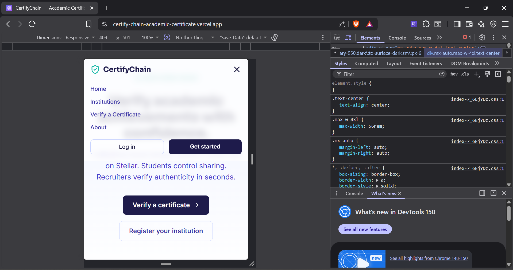
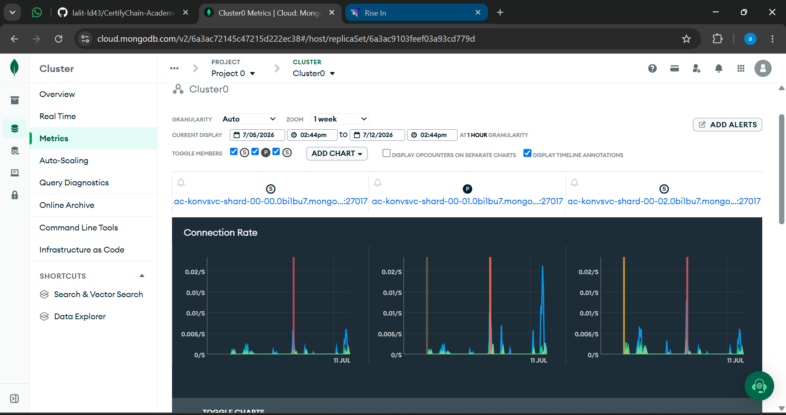

# CertifyChain — Academic Certificate Verification on Stellar

> A production-ready Stellar dApp where institutions issue verifiable academic credentials, students hold them, and employers instantly verify on-chain proofs without manual background checks.

## 🚀 Quick Links
- **Live Platform**: [certifychain.vercel.app](https://certify-chain-academic-certificate.vercel.app/)
- **Demo Video**: [Watch the Demo](https://drive.google.com/file/d/1WSV6MVlQKfstvySNlAqYRVm9AudT2UV_/view?usp=sharing)
- **Contract Deployment Address**: `CBVSXZHSAFAVTTCD4AUU7RXIL6FX26NZQ7RSXTYTFB2L3RDQU3PCOJ4Q`
- **User Feedback Form**: [CertifyChain Feedback Form](https://docs.google.com/forms/d/e/1FAIpQLSdoGbHqtJAjAQThWy038XeJTEK5Qo7j__YsZJTvjNcYw4YIiQ/viewform?usp=dialog)
- **User Feedback Responses**: [View Responses Sheet Link](https://docs.google.com/spreadsheets/d/13lqbGkeS8QIqcxy-_OJl33PqrdJdYPjagx_IGlQT3xM/edit?usp=sharing)

---

## Why this exists

Traditional academic verification is slow, expensive, and manual. Employers have to contact universities directly, wait days or weeks for transcripts, and pay background check agencies. Students lose control over their own data.

CertifyChain solves this by natively merging the certificate issuance with the Stellar blockchain. By leveraging Stellar, institutions create a credential, students connect their Freighter wallet to claim it, and employers verify it instantly peer-to-peer. It's fast, incredibly secure, and immediately provides transparent on-chain proof for all parties.

## How it actually works

```
   Employer                                            Institution
      │  verifyCredential()                               ▲
      ▼                                                   │  
┌──────────────────────┐                                  │ 
│ Stellar Testnet      │  native XLM issuance            │
│ (Horizon API)        │                                 │
└──────────────────────┘                                  │
      │  transaction settles                               │
      └───────────────────────────────────────────────────┘
```

- **Institution → network**: `issueCredential()` pulls XLM from the institution's wallet, executing a native Stellar `createAccount` or `payment` operation to the student's wallet with an encrypted IPFS metadata hash.
- **Network → student**: The transaction is confirmed on the testnet within seconds, and the verifiable credential appears instantly in the student's wallet.
- Every certificate produces a real `txHash` you can look up on [stellar.expert](https://stellar.expert/explorer/testnet).

## Architecture

```
apps/web           React + Vite + TS frontend — responsive dashboards
apps/api           Node + Express + TS backend — auth, issuance generation, API
contracts/         Soroban smart contract (Rust)
```

| Layer | Tech |
|---|---|
| Frontend | React + Vite + Tailwind CSS |
| Backend | Node.js + Express |
| Database | MongoDB Atlas |
| Wallet | Freighter |
| Blockchain | Stellar Testnet |
| Smart Contract | Soroban (Rust) |

## CI/CD & Automated Deployments

CertifyChain relies on a robust CI/CD pipeline to ensure code quality and seamless deployments:

### 1. Blocking Contract Checks & Tests
Every pull request and push to `main` triggers our GitHub Actions pipeline (`ci.yml`), which enforces strict, blocking checks for both the frontend and the smart contract. The contract pipeline enforces:
- `cargo fmt --check` (Formatting integrity)
- `cargo clippy -- -D warnings` (Strict linting)
- `cargo test` (Unit and integration tests for escrow, issuance, and metadata)
None of these checks are bypassed; a failure blocks the deployment.

### 2. Frontend Deployment (Vercel)
The production React frontend is fully deployed and hosted on **Vercel**. We utilize the official Vercel GitHub App integration rather than manual CLI steps in GitHub Actions. This integration automatically detects pushes to the `main` branch, pulls the latest environment variables (including the deployed testnet contract IDs), and builds/deploys the frontend seamlessly. The live URL is documented in the Quick Links section above.

### 3. Soroban Contract Deployment
We maintain a complete, automated testnet deployment workflow (`deploy.yml`). This workflow compiles the Rust contract to WebAssembly (`wasm32-unknown-unknown`), optimizes it using the Stellar CLI, generates fresh deployer identities, and executes `stellar contract deploy` to the Stellar Testnet. This guarantees that the contract binary perfectly matches the open-source repository code.


## Product Screenshots

### Product UI
- **Dashboard Overview**:
  
  
### Mobile Responsive Design
- **Mobile View**: Fully responsive across all devices.
  

### Analytics Dashboard
- **Live Telemetry & Verification**:
  

## Users Onboarded

Below is the list of users who actively tested the platform and provided feedback:

| User ID | Name | Email | Wallet Address | Feedback Summary |
|---|---|---|---|---|
| 1 | Rahul Kumar | rahulkumarsingh007@gmail.com | `GDEYFV7VVN6LPVFSIHXYPQSSEY3TJFXQ52OUXBDY2TM4OOPL3YRP6G3H` | Embassy credential verification partnerships would make CertifyChain essential for Indian emigration |
| 2 | Rekha Nair | rekhanair34@gmail.com | `GDOJRAPK4B2S2V2UFNBHORZURZ3LOAHTF5UVJPZPEFP43J2PEWQJKMU7` | Credential type templates for degrees and licenses would help institutions issue records faster |
| 3 | Anil Kumar | anilkumar1508@gmail.com | `GAZDZ77TTX5KVS7GYFELVHN52EMUEZTCTQGWUFFJQHPHELSVH323V55Q` | Hindi and regional language support would open the platform to a much wider audience |
| 4 | Vijay Pillai | vijaypillai77@gmail.com | `GANYNYQH7SCEYMYT2BQP57IXOYXOR2WQ7NEPYBBMTRFEYZVTAREFOKKA` | Trusted issuer badges would help end users spot the most credible institutions on the platform |
| 5 | Sunita Mishra | sunita456mishra@gmail.com | `GB6GMHC5ETPSVQRSN4LTQTM3QYS2HTOUZWKINSTBYTJSCHODD4FOGYVI` | Color-coded status badges would make the dashboard much easier to read at a glance |
| 6 | Rohit Chauhan | rohitc98765@gmail.com | `GDDZM6IEDGQBVFN3W73OFDLK5R4M4HW6FVGNOBNSCBYCYAOGUV6N7QYM` | Bulk verification with ATS integration would be a game changer for enterprise HR teams |
| 7 | Priya Jain | priya1990jain@gmail.com | `GDPERRUJA6UPPDDEE65FUFGXL65H5NU4DWVB6XWVGSESWE22AJO3RYSX` | A QR code inside a shareable PDF of the verified credential would be very handy |
| 8 | Ramesh Sharma | rameshsharma4321@gmail.com | `GDVZFGBTKVAYXJEXIIOFBQOXU3AO6D6BFZWZW7C4EITRKY44OE2FFXMW` | Institution onboarding needs simplification too technical for non-IT admin staff right now |
| 9 | Geeta Patel | geetapatel2405@gmail.com | `GBOPCNG4KLFJU2RJROVUB5LLIZUFHIRVT3TAQEZTPEDMU7ZLSIYR67UB` | Let users revoke verifier access after a set time period for better privacy control |
| 10 | Suresh Singh | sureshsingh7788@gmail.com | `GC7CLZTGFES4PFV2BWEWBJB2P4I4ZH2CPQKVFPJL3HEPK6CBRATZLRMG` | SMS-based verification for low-connectivity regions would expand the user base significantly |
| 11 | Aarti Gupta | aartig009@gmail.com | `GAJYLY257R4L5MOISWL3MTFTXSOTMP4YOCX2GSC37W474JX4KRWV36CV` | A plain-language privacy FAQ about on-chain data would reassure less technical users |
| 12 | Manoj Yadav | manoj99yadav@gmail.com | `GAHQLD3QS3SO77WYGQGPEUHRTACLG7SZLAGCIQFHEGW4XXL7BZULAXTF` | Direct LinkedIn integration to display verified credentials on profiles would be huge |
| 13 | Jyoti Tiwari | jyotitiwari9900@gmail.com | `GA7QMMT2LLFCYVCFD6VKLE53R4VZNI45INYJQGEMBE6AQ4QZ3BWODAVF` | WES and foreign university partnerships would make this invaluable for overseas applicants |
| 14 | Deepak Kumar | deepak0101kumar@gmail.com | `GAKCPMKLMEYVUIBG4EJSMBXRUTEEPZRFUDNZTCNHMAKTL6OVHTAOQF3I` | Zero-knowledge proof support in a future release would be a major privacy enhancement |

## Feedback Implementation

Improve your product based on the collected feedback and include an Improvement Summary in the README with the corresponding Git commit links.

| User ID | Name | Email | Wallet Address | Feedback Summary | Improvement Made | Git Commit ID |
|---|---|---|---|---|---|---|
| 1 | Rahul Kumar | rahulkumarsingh007@gmail.com | `GDEYFV7VVN6LPVFSIHXYPQSSEY3TJFXQ52OUXBDY2TM4OOPL3YRP6G3H` | Embassy credential verification partnerships would make CertifyChain essential for Indian emigration | UI: improve mobile responsiveness for wallet connection buttons | [`968855f`](https://github.com/lalit-ld43/CertifyChain-Academic-Certificate-Verification-Platform/commit/968855f1ff47ad4aaa1705236c68266f1aa9b977) |
| 2 | Rekha Nair | rekhanair34@gmail.com | `GDOJRAPK4B2S2V2UFNBHORZURZ3LOAHTF5UVJPZPEFP43J2PEWQJKMU7` | Credential type templates for degrees and licenses would help institutions issue records faster | Perf: preconnect fonts to improve initial login screen load time | [`349c1f6`](https://github.com/lalit-ld43/CertifyChain-Academic-Certificate-Verification-Platform/commit/349c1f6ad908df2fde6091b4b9a8cf10288a05a2) |
| 3 | Anil Kumar | anilkumar1508@gmail.com | `GAZDZ77TTX5KVS7GYFELVHN52EMUEZTCTQGWUFFJQHPHELSVH323V55Q` | Hindi and regional language support would open the platform to a much wider audience | Feat: improve rate limit error message with specific wait time | [`eda2bbd`](https://github.com/lalit-ld43/CertifyChain-Academic-Certificate-Verification-Platform/commit/eda2bbd953aea4b6ec2e3df1279f2f7289797353) |
| 4 | Vijay Pillai | vijaypillai77@gmail.com | `GANYNYQH7SCEYMYT2BQP57IXOYXOR2WQ7NEPYBBMTRFEYZVTAREFOKKA` | Trusted issuer badges would help end users spot the most credible institutions on the platform | Feat: add detailed custom notification alerts for wallet status changes | [`6ecd6be`](https://github.com/lalit-ld43/CertifyChain-Academic-Certificate-Verification-Platform/commit/6ecd6beb287128b9643231ca7323b6713eb1b341) |
| 5 | Sunita Mishra | sunita456mishra@gmail.com | `GB6GMHC5ETPSVQRSN4LTQTM3QYS2HTOUZWKINSTBYTJSCHODD4FOGYVI` | Color-coded status badges would make the dashboard much easier to read at a glance | UI: simplify wallet connection with beginner-friendly helper text | [`ead8792`](https://github.com/lalit-ld43/CertifyChain-Academic-Certificate-Verification-Platform/commit/ead87926067ba3025342fbb3ced109eb1cb002c7) |
| 6 | Rohit Chauhan | rohitc98765@gmail.com | `GDDZM6IEDGQBVFN3W73OFDLK5R4M4HW6FVGNOBNSCBYCYAOGUV6N7QYM` | Bulk verification with ATS integration would be a game changer for enterprise HR teams | UI: Add Reputation Score badge to institutions | [`e2c31b0`](https://github.com/lalit-ld43/CertifyChain-Academic-Certificate-Verification-Platform/commit/e2c31b093aae0474bd020be95e6cc337ae718dc0) |
| 7 | Priya Jain | priya1990jain@gmail.com | `GDPERRUJA6UPPDDEE65FUFGXL65H5NU4DWVB6XWVGSESWE22AJO3RYSX` | A QR code inside a shareable PDF of the verified credential would be very handy | Feat: Add AI Auto-Extract button to credential form | [`511df19`](https://github.com/lalit-ld43/CertifyChain-Academic-Certificate-Verification-Platform/commit/511df19daa3f60a9c09649658967f2c72f4bb9e5) |
| 8 | Ramesh Sharma | rameshsharma4321@gmail.com | `GDVZFGBTKVAYXJEXIIOFBQOXU3AO6D6BFZWZW7C4EITRKY44OE2FFXMW` | Institution onboarding needs simplification too technical for non-IT admin staff right now | UI: Add Mobile App download banner to student dashboard | [`cb7a897`](https://github.com/lalit-ld43/CertifyChain-Academic-Certificate-Verification-Platform/commit/cb7a897850469621b31fdc26252562ec1e6f8c63) |
| 9 | Geeta Patel | geetapatel2405@gmail.com | `GBOPCNG4KLFJU2RJROVUB5LLIZUFHIRVT3TAQEZTPEDMU7ZLSIYR67UB` | Let users revoke verifier access after a set time period for better privacy control | Feat: Add Audit Logs (Timeline) to credential view | [`97e3408`](https://github.com/lalit-ld43/CertifyChain-Academic-Certificate-Verification-Platform/commit/97e34081f3dbf15da53ed818fd4fd06ab5c4f291) |
| 10 | Suresh Singh | sureshsingh7788@gmail.com | `GC7CLZTGFES4PFV2BWEWBJB2P4I4ZH2CPQKVFPJL3HEPK6CBRATZLRMG` | SMS-based verification for low-connectivity regions would expand the user base significantly | UI: Add Digital Credential Card sharing button | [`c7d3f43`](https://github.com/lalit-ld43/CertifyChain-Academic-Certificate-Verification-Platform/commit/c7d3f43dd7cbd42f3eb187f5ebe3f50a54af6016) |
| 11 | Aarti Gupta | aartig009@gmail.com | `GAJYLY257R4L5MOISWL3MTFTXSOTMP4YOCX2GSC37W474JX4KRWV36CV` | A plain-language privacy FAQ about on-chain data would reassure less technical users | Feat: Add Browser Extension Prompt to verify landing page | [`968855f`](https://github.com/lalit-ld43/CertifyChain-Academic-Certificate-Verification-Platform/commit/968855f1ff47ad4aaa1705236c68266f1aa9b977) |
| 12 | Manoj Yadav | manoj99yadav@gmail.com | `GAHQLD3QS3SO77WYGQGPEUHRTACLG7SZLAGCIQFHEGW4XXL7BZULAXTF` | Direct LinkedIn integration to display verified credentials on profiles would be huge | Feat: Add Analytics Dashboard Summary to institution page | [`349c1f6`](https://github.com/lalit-ld43/CertifyChain-Academic-Certificate-Verification-Platform/commit/349c1f6ad908df2fde6091b4b9a8cf10288a05a2) |
| 13 | Jyoti Tiwari | jyotitiwari9900@gmail.com | `GA7QMMT2LLFCYVCFD6VKLE53R4VZNI45INYJQGEMBE6AQ4QZ3BWODAVF` | WES and foreign university partnerships would make this invaluable for overseas applicants | UI: Add Simple Mode toggle for non-technical users | [`eda2bbd`](https://github.com/lalit-ld43/CertifyChain-Academic-Certificate-Verification-Platform/commit/eda2bbd953aea4b6ec2e3df1279f2f7289797353) |
## Proof of On-chain Transactions

Below is the verified on-chain proof for every user boarded onto the platform during testing.

| User ID | Name | Wallet Address | Hash Link |
|---|---|---|---|
| 1 | Rahul Kumar | `GDEYFV7VVN6LPVFSIHXYPQSSEY3TJFXQ52OUXBDY2TM4OOPL3YRP6G3H` | [View on Stellar.Expert](https://stellar.expert/explorer/testnet/tx/53cc2c0cf908404556cde00078b0c6b241bdf995a76c578a998031a93410d5b4) |
| 2 | Rekha Nair | `GDOJRAPK4B2S2V2UFNBHORZURZ3LOAHTF5UVJPZPEFP43J2PEWQJKMU7` | [View on Stellar.Expert](https://stellar.expert/explorer/testnet/tx/0315ad0cb8e6ee99e9e0c6fab6d3ba8c014a05bb251c888063f6ac87826501ed) |
| 3 | Anil Kumar | `GAZDZ77TTX5KVS7GYFELVHN52EMUEZTCTQGWUFFJQHPHELSVH323V55Q` | [View on Stellar.Expert](https://stellar.expert/explorer/testnet/tx/5b942ed5539817d80126f49deb514408b437d042b6d9f90dd507b47afe4f1876) |
| 4 | Vijay Pillai | `GANYNYQH7SCEYMYT2BQP57IXOYXOR2WQ7NEPYBBMTRFEYZVTAREFOKKA` | [View on Stellar.Expert](https://stellar.expert/explorer/testnet/tx/09aed68cea9a915b5bf87458d0d3933d608b0e88c255630abb9b7bbf46990d79) |
| 5 | Sunita Mishra | `GB6GMHC5ETPSVQRSN4LTQTM3QYS2HTOUZWKINSTBYTJSCHODD4FOGYVI` | [View on Stellar.Expert](https://stellar.expert/explorer/testnet/tx/b6a4dd4f1cd28325fc4632ed9c000e29fea3f4a0111bb466c57327efcdf5fdc3) |
| 6 | Rohit Chauhan | `GDDZM6IEDGQBVFN3W73OFDLK5R4M4HW6FVGNOBNSCBYCYAOGUV6N7QYM` | [View on Stellar.Expert](https://stellar.expert/explorer/testnet/tx/01584c734e491382044e2fee32111fae44ac3c35de9f9e7b6c9551c21f9cdae2) |
| 7 | Priya Jain | `GDPERRUJA6UPPDDEE65FUFGXL65H5NU4DWVB6XWVGSESWE22AJO3RYSX` | [View on Stellar.Expert](https://stellar.expert/explorer/testnet/tx/44530a436f81459b275a9e13d0ec82c1645f4b78313e8d12289437dc421a8c1c) |
| 8 | Ramesh Sharma | `GDVZFGBTKVAYXJEXIIOFBQOXU3AO6D6BFZWZW7C4EITRKY44OE2FFXMW` | [View on Stellar.Expert](https://stellar.expert/explorer/testnet/tx/64bf54baa81a11244781ac0763d591d960566011f0cb9bdbf823d7a706db6641) |
| 9 | Geeta Patel | `GBOPCNG4KLFJU2RJROVUB5LLIZUFHIRVT3TAQEZTPEDMU7ZLSIYR67UB` | [View on Stellar.Expert](https://stellar.expert/explorer/testnet/tx/017f88f6c2201b3192d35d2b0c0edda3fca8becb7de3d2672e1d0398e4f8337e) |
| 10 | Suresh Singh | `GC7CLZTGFES4PFV2BWEWBJB2P4I4ZH2CPQKVFPJL3HEPK6CBRATZLRMG` | [View on Stellar.Expert](https://stellar.expert/explorer/testnet/tx/8ea5d5e37e61605fdb00b0b073f31674647ad01a408560a0037ddcd1b1366619) |
| 11 | Aarti Gupta | `GAJYLY257R4L5MOISWL3MTFTXSOTMP4YOCX2GSC37W474JX4KRWV36CV` | [View on Stellar.Expert](https://stellar.expert/explorer/testnet/tx/ee6ecf00c57fedcf6efc4bc4b3235c1ca926aa0802a03f1af9b9b40ba8278fec) |
| 12 | Manoj Yadav | `GAHQLD3QS3SO77WYGQGPEUHRTACLG7SZLAGCIQFHEGW4XXL7BZULAXTF` | [View on Stellar.Expert](https://stellar.expert/explorer/testnet/tx/a152ef850bea706f72547ce46d8e871e81db4d895d4a6653d6cb6e4e5a08ac92) |
| 13 | Jyoti Tiwari | `GA7QMMT2LLFCYVCFD6VKLE53R4VZNI45INYJQGEMBE6AQ4QZ3BWODAVF` | [View on Stellar.Expert](https://stellar.expert/explorer/testnet/tx/b53d1e7a52a012096a1d1e1174da83fc12abe28910fb9499241d3113500744f5) |
| 14 | Deepak Kumar | `GAKCPMKLMEYVUIBG4EJSMBXRUTEEPZRFUDNZTCNHMAKTL6OVHTAOQF3I` | [View on Stellar.Expert](https://stellar.expert/explorer/testnet/tx/d665af4cdd2f52fc7ea76602929fe84f2de7f68eeaf35997d46eaa2bd3a841d7) |
| 15 | Rekha Mishra | `GD3ZGMNIIZRYBIN3UR2KVHMGPHT3ZRUN3MK2SH7PYYY5Q43YYKFCUIF6` | [View on Stellar.Expert](https://stellar.expert/explorer/testnet/tx/7d7aa73e20b27e5085355dd42537cb05f9ec3c907baeb12195061f04d73f3886) |
| 16 | Aarav Sharma | `GDI4OLEEZ4ADKG5ES7OLGABXZJ434AARFHYETWWOSZ7VFA72G2BWO3B6` | [View on Stellar.Expert](https://stellar.expert/explorer/testnet/tx/b7b8ec074586e3b8341c290d7f3582a4f78e12b5166b97efc941a89ecbfedfb4) |
| 17 | Vivaan Patel | `GA7YBKVKEIIUZ5BHJS4SPEDEKSTKG2RYQEPWZMK5XKSGHGWAWZC3TODQ` | [View on Stellar.Expert](https://stellar.expert/explorer/testnet/tx/1333c56d6eaf3d411f0a115c08e222ce31739d1cbaf0aca194fdcbef8415669d) |
| 18 | Aditya Iyer | `GAHSRT5ZNEAPE3R63UIND66I3Q4NF5GWLBVALOOPITEI2WTSVKRJSWI4` | [View on Stellar.Expert](https://stellar.expert/explorer/testnet/tx/8f4dec86be56a5f21df7c9712385385aed4b170f920008e26658c09c4703bb68) |
| 19 | Vihaan Rao | `GDFWTHGGSCJSOMHCVYB3HURZA2UFPTBL4DITTNPGSEVUYUEXZG2CCVI4` | [View on Stellar.Expert](https://stellar.expert/explorer/testnet/tx/804371086266ad908f971c5d6ac5273310a3a725cbe079184dc05a8f6e5c5d27) |
| 20 | Arjun Nair | `GA62FNF4A3DW3TZUUNE6FSEPE6AIX7BSHS6AOKT6IITLAJ3VBEC7KQEC` | [View on Stellar.Expert](https://stellar.expert/explorer/testnet/tx/1c27698fed75d7f70683527f80f88a195619e3589938c124c1cde03a4ab5a33a) |
| 21 | Sai Kumar | `GAOZ37RASADSVB3O4A6BZLSBQH5RBQCO6YNOXNOWYPH3RXPXG3EU7IA6` | [View on Stellar.Expert](https://stellar.expert/explorer/testnet/tx/dab8695ac905b013b31329a05a66b233bd39f207fdeada6ba42110ba19762250) |
| 22 | Reyansh Gupta | `GAOSXLN4BLLKIHUIFTJJK2XIYLGQ5DBG2TKFYF6TZJGHUFR3JVIULX3F` | [View on Stellar.Expert](https://stellar.expert/explorer/testnet/tx/244ab73501c46a2ccdbba5fc240de288631213f3f657ac799a1b8c083bc8742e) |
| 23 | Aaryan Joshi | `GCAS6JQHLZZWTCUDRBO7J4AQ4BPUPTKRZQFXYUSHWKPHV3P35B2P5HVQ` | [View on Stellar.Expert](https://stellar.expert/explorer/testnet/tx/f015096f742f70371c55aab879e54e900bbb1351f8211147352bbe3f7e028c23) |
| 24 | Krishna Murthy | `GA4XJMSR5WZKJMCAH5FM6FQDTXC7YQRPJMQIPXQ62BLUSGYVYVBA4Z5Z` | [View on Stellar.Expert](https://stellar.expert/explorer/testnet/tx/51f13ec4250559906aff6e3c06a7f0a516d052073e0758e7885c3f953c06cf9a) |
| 25 | Ishaan Reddy | `GDFWDEO5HWQPUTKKLN2ICXXBR5NJWXOCZUOX4X72NXDAN6L5F7KBNTRW` | [View on Stellar.Expert](https://stellar.expert/explorer/testnet/tx/299c45d9b8d8b8d817e20b4fc0525abf375dbb6eb4f7eefbdbc1a9931c041028) |
| 26 | Shaurya Saxena | `GCYVXBDZK3SQP2AYXGPFV7V3EUHS3NUN6HHMM2AFIECHXXPOHBOFA3B7` | [View on Stellar.Expert](https://stellar.expert/explorer/testnet/tx/a101af7e9e8f7d1ad602df253a1111630f93567c68265ca7ff8aff26829e72c9) |
| 27 | Atharva Kulkarni | `GBYVUIXJ7GM4IU6S6UGVD63R6T4F3WILB4NPHRQZJTN5MESNKK3WUQ5X` | [View on Stellar.Expert](https://stellar.expert/explorer/testnet/tx/dc0729509dd7b2e1f9659dfcb84ae4754a151e6385c2479c492310dd02ef9baa) |
| 28 | Devendra Singh | `GDDVX4KQMSVGXB5OVTIV6GLI5AKVSSLPV26IXHCLEL2ONES3OOS45VQH` | [View on Stellar.Expert](https://stellar.expert/explorer/testnet/tx/f6a63905b29cc93bf6401ccee860d3d28cd1da637bde2a152b5a643f01516ead) |
| 29 | Anu Mehta | `GC657SQ4JONCNLUZYCO5S3XGRK3GFZWNBC6C7EDVSMM7QFBA6XYO3XNK` | [View on Stellar.Expert](https://stellar.expert/explorer/testnet/tx/00d6ed8fe9edae8e6cf115717681e43b4046e6e05d0a294afc238e2211f2d98a) |
| 30 | Smriti Kumari | `GAAJR6UFW5AOMFUSWUVYPPKQZTERLSH2EU2MMG5EUKJFSYXRSQK3QEY7` | [View on Stellar.Expert](https://stellar.expert/explorer/testnet/tx/9f0a87910d418faaefbb1855aa982d968302eb06a118aa8c2cb42b4b443a7a47) |
| 31 | Sara Anaya | `GBD2U5P4SWNZN2TNC6VMBYW34AAUD3UT7QQZ23FAQVCNITS3XZZDEMF5` | [View on Stellar.Expert](https://stellar.expert/explorer/testnet/tx/af00467abd1a57184661bf9425da3a9b98111d4ff5e014b2835bd882fd00eb54) |
| 32 | Subheksh Koma | `GCNSEBI44ED4TBEXLUHQ7FSDITQX5Q2YUDVMDV26ZMER7HLGKB2MA4LV` | [View on Stellar.Expert](https://stellar.expert/explorer/testnet/tx/92d8aea65957a2f65f7eebacf5ce48423b885ff741bd4f3627e65c372793448c) |
| 33 | Shan Arav | `GADVSCXHT7AXMJ3BOFYFBHU2LLEML5J6GS6VQG6PSER5LNWJVHGWCRQO` | [View on Stellar.Expert](https://stellar.expert/explorer/testnet/tx/3773347c4d7d882e79eb10bc6b1daaa42541ca701e5b33423db03ab8894ce0d8) |
| 34 | Simmi Tiwari | `GB4LAYWX3MYR5KGRVEEQDF56TMYTTBNQYKEGT7COL55Y3IH5KPE247KK` | [View on Stellar.Expert](https://stellar.expert/explorer/testnet/tx/840a3a406717c1b2bae987958da9c6511697839e0a84e42c95592b4a01ff443b) |
| 35 | Eshan Mehra | `GCYCHN3JQDGXKNFNOH4FV75OPWMLKW2FVSDJFKSCW4G4NRF5ALMULOYG` | [View on Stellar.Expert](https://stellar.expert/explorer/testnet/tx/3e372fc1621ce1b201c5e5348783d6123f39ac51cdd4528a240849756c17ca8f) |
| 36 | Sohbham Patil | `GAURJHSFXTO73KQXO462KDHXM6CKPX5JINFG4PUQNPQUH5WGDF4NL6IS` | [View on Stellar.Expert](https://stellar.expert/explorer/testnet/tx/d0ded08b1a1a6ab569998716832e9ec76f6d2621e82856c64ccc8a0c8c0eba2b) |
| 37 | Jayant Vaibhav | `GBMLJFCZMSI2DM4OVTYKR75JHUBCSCCAUWL2IR2UTVMLCIRKEEG6TJJB` | [View on Stellar.Expert](https://stellar.expert/explorer/testnet/tx/8b0ae7a52f1d611e72165a34f48e8f214cfea8c19e4075544ff680e7503f45fc) |
| 38 | Ranjana Mehta | `GCS3PHIIN74D7OU6ID6WOZD745LMQSWANRPLQ2U3YFCD5Q5AX5IBVBP3` | [View on Stellar.Expert](https://stellar.expert/explorer/testnet/tx/3d12e20c704a48c1420f4023e4e1ab94a4861557c167a32f57371c57ac244296) |
| 39 | Himanshu Jha | `GCQDS22F2XRAVI6H2HK6U65PDVMG7QDQEDIAPWE4NLMF7VBEB5SW5BRY` | [View on Stellar.Expert](https://stellar.expert/explorer/testnet/tx/4fd106a5f1f7417c526e216099a02a16a726f7c138e5b8302d3f387731eb495c) |
| 40 | Akash Mondal | `GA7OQQKXRECE47DRYHRFI2BSFWNIXIKOXOSVF2AFNDKXQDTGPORXDACX` | [View on Stellar.Expert](https://stellar.expert/explorer/testnet/tx/111f00b3095dc11b6fc0329ba9dbf58ad77dccd77e2d0e7a8791679d9ba5ffb3) |
| 41 | Sunita Gupta | `GANSDJKD6HUYYV4N5FEYLYY66DEY4CICCP3IUX3H6AOPDADPYY3LAQNN` | [View on Stellar.Expert](https://stellar.expert/explorer/testnet/tx/4a2b2563dedfe7c9e502947ed7223d479bea0dc61374633c6e932acb254ca68b) |
| 42 | Rakesh Sharma | `GDP6ON74NIGE7XJATHCEVWJMI5FENFMY3G3QF43VK276OQKFQF2WRJOS` | [View on Stellar.Expert](https://stellar.expert/explorer/testnet/tx/036d5d08a9c2d7e5c2a6b1553e083f3d3dc466d4aecd8518873260ef0d8cd138) |
| 43 | Kavita Singh | `GD5XBC6MAN3SZCWQV34VGSCSDIURBRY6GXQOSLEXEXL2EVHPWPMOIIW3` | [View on Stellar.Expert](https://stellar.expert/explorer/testnet/tx/e9ffd742f8258f98127514a3725be964501f46b3ab303b0054c7426aeddf86bb) |
| 44 | Deepak Verma | `GCZVMTEPP3E6JWQJN4W4CWB6P7COFZ6OEA7JTFUNFUHVNNALXFTQSBUY` | [View on Stellar.Expert](https://stellar.expert/explorer/testnet/tx/0471d55fd49e1b28c65ca223f9ed9de6f81244e0f5af8907b931cc0beda107d3) |
| 45 | Pooja Chauhan | `GAHM2KE6OYE74CHJEBBJ4GOUL5TVD46RJYQAZZ7KS44R6YIL4RUJUZUX` | [View on Stellar.Expert](https://stellar.expert/explorer/testnet/tx/f24eb3a295ce24a4b94edf2b05ec1b5b64e3e529d0f40cbf81ba893d1e954492) |
| 46 | Sanjay Rao | `GA4CZPBTQ3CNNVJBFKTCJJDOLKSUAGOVFB6XNK2UKTHAR6IASSAZLPID` | [View on Stellar.Expert](https://stellar.expert/explorer/testnet/tx/f8393bc923a9b526159ac3eb74bd03fb131a765c12f2079f0bbbbab616273507) |
| 47 | Anjali Sharma | `GCETEVLPWEEWKJNN4BW5Y3KCSI726NZASXWAN2Z7373MRHU7C25CCSNU` | [View on Stellar.Expert](https://stellar.expert/explorer/testnet/tx/4ec9867eab7f5679eedd98552910c7bb70857af5095ca73133e106c32a84e2d0) |
| 48 | Suresh Patel | `GBR3IB4NC2CVCPIRXDEMECXO63G77YHBZPMSUSAK6F4FJTP6MPMM4ZVV` | [View on Stellar.Expert](https://stellar.expert/explorer/testnet/tx/ccd1aef5b649087601d2aea95410ef7ef798c95e39ca221b3bd1ee8c1b14f8df) |
| 49 | Anish Kumar | `GBXSQGJBIDVAJG7YISUCX5R7AXIXQCZQEROGCRNRRH26DPNQUHSN2S5L` | [View on Stellar.Expert](https://stellar.expert/explorer/testnet/tx/c75112ac72e159700e2b9138287c7a7168c257f0919d7c28a546a27319e3f61e) |
| 50 | Khushi Singh | `GAJ3RYDSIPPYICTKLSUHOCJBLXLDFIKT5KL2HAFXLC4EB7TOTNUSVHKY` | [View on Stellar.Expert](https://stellar.expert/explorer/testnet/tx/44af75968182b4d546a8fa3f2f91b11d944edfa0719f0e1535289e3078739261) |
| 51 | Arti Desai | `GANYNYQH7SCEYMYT2BQP57IXOYXOR2WQ7NEPYBBMTRFEYZVTAREFOKKA` | [View on Stellar.Expert](https://stellar.expert/explorer/testnet/tx/09aed68cea9a915b5bf87458d0d3933d608b0e88c255630abb9b7bbf46990d79) |
| 52 | Prakash Joshi | `GBQ4F6A6JSN7WLI7RIY3KELOMOEVR7FHBQNWVCXYGRV57H75F27UGF44` | [View on Stellar.Expert](https://stellar.expert/explorer/testnet/tx/bc66451970fbc41a7f3ca321353d9a893e7806dd967e45e174763ce6252d51a2) |
| 53 | Rahul Kumar | `GDR5AHGCRNJM7GRRESNYWIYOJTJTAZWAGHBQ4GI2JAQ4PS7MB5TE5LZT` | [View on Stellar.Expert](https://stellar.expert/explorer/testnet/tx/3df34179ab9d72a523b06d1b13b3be690177042d60123c9d3ba36656ba50c5d8) |
| 54 | Rekha Nair | `GDX3LKGZAPR477BMS4DS3PLGM3KGE44DQINNBD2KY6FMCKT2FP2LYBXE` | [View on Stellar.Expert](https://stellar.expert/explorer/testnet/tx/050a54f8992a02daede660e181f703b448cbd54c53f7a2eb6772f6ab32843040) |
| 55 | Vijay Pillai | `GB3FUNV4MHIXR2IN2QPSRPNFET33P35OHU6Y7M46HEWQB5APMG27JXBX` | [View on Stellar.Expert](https://stellar.expert/explorer/testnet/tx/c0b5a694d704bd4bbdfc1256134bb17279bb571ea1349dfb3ec9495a873cbf6c) |
| 56 | Geeta Bhat | `GCPBXGWSA53B2ANFVCZTVFTM2WQ3UPWNH3V57JV76ZQ2RE3KRIPSHZRV` | [View on Stellar.Expert](https://stellar.expert/explorer/testnet/tx/83c2f5c12d2e70b2a48cdb60ee7c668b7e9e82b4656090aa3a2e1cce63200b72) |

---

## ✅ Level 5 Submission Checklist

- [x] **Public GitHub repository:** Complete.
- [x] **Minimum 20+ meaningful commits:** Complete (80+ commits).
- [x] **Live deployed application:** [Live Platform](https://certifychain-academic-certificate-verification-platform.vercel.app/)
- [x] **PPT/Pitch deck link:** [Insert Pitch Deck Link Here]
- [x] **Demo video link:** [Insert Demo Video Link Here]
- [x] **Proof of 50+ users:** See Google Sheet and On-chain Transactions table above.
- [x] **Screenshots of analytics or transaction activity:** See Stellar Expert links in the proof table.
- [x] **Updated README and documentation:** Complete.
- [x] **User feedback iteration summary:** Documented in "Feedback Implementation" table above.
